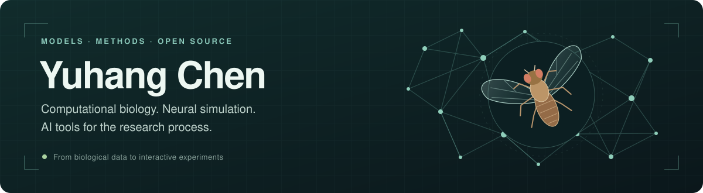
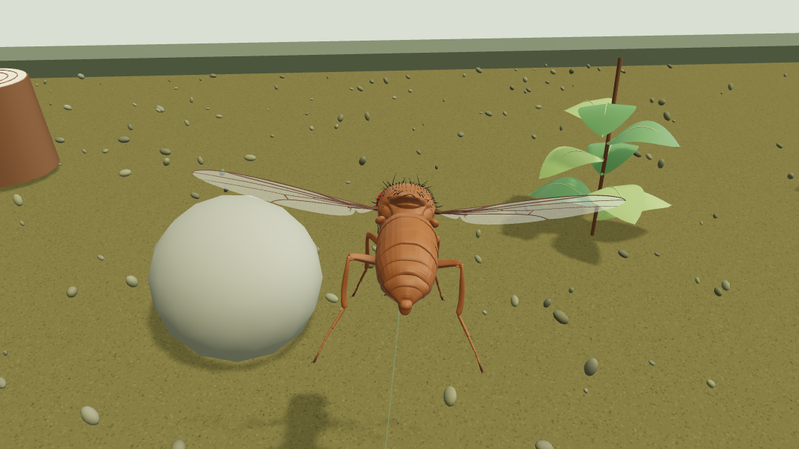
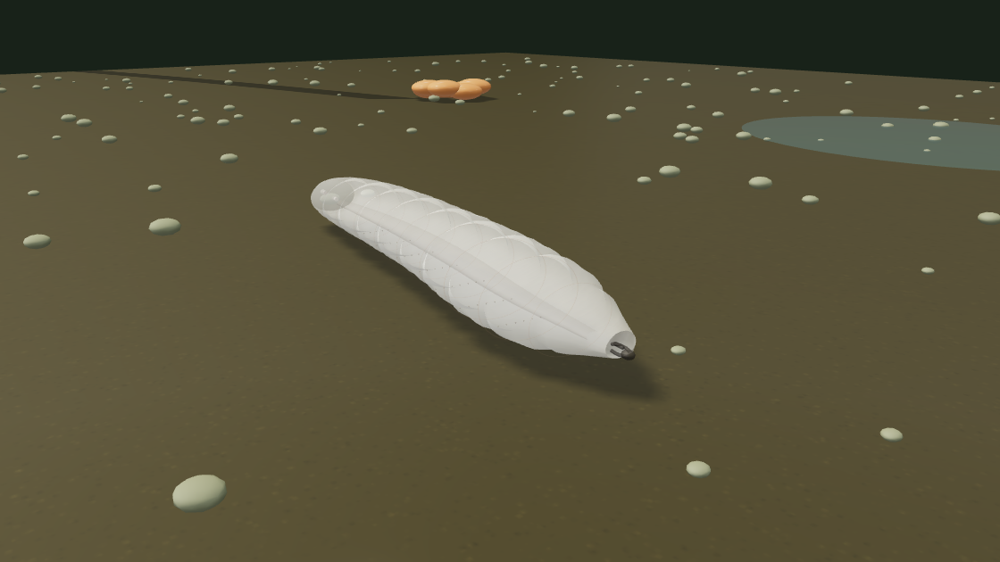
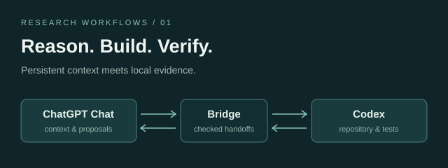

  

I build biological models you can explore and research tools you can reuse. My work connects **computational biology, neural simulation, and AI-assisted research**, with an emphasis on inspectable assumptions and reproducible workflows.

  
  &nbsp;
  

## From neural circuits to virtual animals

Two interactive habitats, from a crawling larva to a flying adult. Open a demo, follow the animal, and edit its world.

<table>
<tr>
<td width="50%" valign="top">

<h3>Cyberfly Explorer</h3>

A detailed GLB fruit fly with ground exploration, autonomous 3D flight, an editable habitat, and a third-person camera.

Three.js · MaleCNS model · Lightweight flight

<a href="https://chenyvhang.github.io/cyberfly-explorer/"><b>Play in your browser ↗</b></a> &nbsp; · &nbsp; <a href="https://github.com/ChenYvhang/cyberfly-explorer">Source code</a>

</td>
<td width="50%" valign="top">

<h3>CyberLarva</h3>

A deformable larva connecting neural activity, segmental movement, and an editable world, with virtual neuron-silencing experiments.

Larval connectome · MuJoCo · Three.js

<a href="https://chenyvhang.github.io/cyber-larva/"><b>Play in your browser ↗</b></a> &nbsp; · &nbsp; <a href="https://github.com/ChenYvhang/cyber-larva">Source code</a>

</td>
</tr>
</table>

Browser demos use reduced controllers for instant access. Full neural models and MuJoCo physics run locally; each repository documents its data sources and modeling limits.

## Tools for the research process

<table>
<tr>
<td width="50%" valign="top">

<h3>Codex Bridge to ChatGPT</h3>

Keep one ChatGPT conversation in the loop while Codex checks proposals, applies files, and verifies work in the repository.

JavaScript · Agent Skill · Local MCP

<a href="https://github.com/ChenYvhang/codex-bridge-chatgpt"><b>Explore the workflow ↗</b></a>

</td>
<td width="50%" valign="top">

<h3>Academic Poster</h3>

Turn papers, slides, and research materials into editable scientific posters matched to the venue, with rendered visual checks.

Codex · Claude Code · OpenClaw · PPTX

<a href="https://github.com/ChenYvhang/academic-poster"><b>Explore the skill ↗</b></a>

</td>
</tr>
</table>

More research workflows: [independent model review](https://github.com/ChenYvhang/claude-code-codex-reviewer) · [advisor & lab due diligence](https://github.com/ChenYvhang/advisor-due-diligence) · [Challenge Class posters](https://github.com/ChenYvhang/challenge-class-annual-poster).

## Computational biology & methods

| Project | Question / approach |
| :--- | :--- |
| [Bridge UMI Error Correction](https://github.com/ChenYvhang/bridge-umi-error-correction) | Bayesian, region-aware, indel-tolerant correction of molecular identifiers. |
| [Protein Language Models for DNA Binding](https://github.com/ChenYvhang/protein-language-model-dna-binding) | Protein embeddings, classical ML, CNNs, and LoRA for DNA-binding prediction. |
| [Kuramoto Brain Network Modeling](https://github.com/ChenYvhang/kuramoto-brain-network-modeling) | Connectome synchrony, network hubs, perturbations, and disease-network simulations. |
| [Biology Model Evaluation](https://github.com/ChenYvhang/biology-model-evaluation) | Evidence-based evaluation of biological models through case studies. |

**Working toolkit** — Python / NumPy / SciPy · JavaScript / Three.js · MuJoCo · C++ · Git / GitHub · agent workflows.

**Current interests** — connectome-informed behavior, embodied biological models, protein representations, and research tools that make their evidence easy to inspect.

<b>Data products, coursework & earlier experiments</b>

- [LinkVerse](https://github.com/ChenYvhang/linkverse) — creator discovery through data collection, potential scoring, and multimodal matching.
- [Glimmer Scout](https://github.com/ChenYvhang/glimmer-scout) — creator-potential and resonance analysis with GBDT and multimodal models.
- [Bioinformatics · Peking · 2026 Spring](https://github.com/ChenYvhang/Bioinformatics-Peking-2026Spring)
- [Programming Practice 2026](https://github.com/ChenYvhang/2026-Programming_Practice)
- [PKU iGEM Exercises](https://github.com/ChenYvhang/cyh-igem)

---

Open a project's issue tracker to discuss its methods or contribute. [Browse all repositories →](https://github.com/ChenYvhang?tab=repositories)
